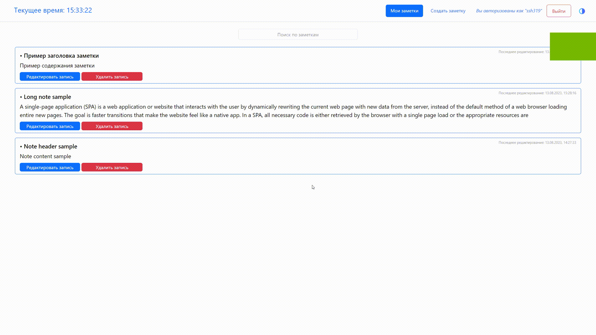

# Cloud Notes

Notes Web application made as a Fullstack pet project

## About

### Main functionality
- Storing and reading notes with Web Application
- Creating & editing notes with saving the last edit date, deleting
- Complete authentication

### Additional features
- Filtering notes by text occurences
- Dark/Light theme choice

### Technologies
1. Backend
    - Python
    - Django
    - Django Rest Framework
    - Token-based Authentication

2. Frontend SPA
    - JavaScript
    - ReactJS
    - HTML
    - CSS

3. Database
    - PostgreSQL RDBMS
    - Django ORM
    - SQLite3 as Development DB

4. Version Control
    - Git
    - GitHub

## GIF Demo

